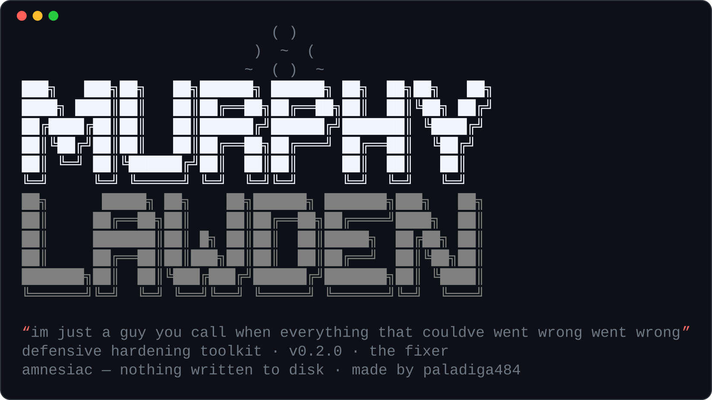

<div align="center">



# 🛡️ Murphy Lawden

**Cross-OS defensive hardening + antivirus toolkit** — read-only by default; harden with a reversible autopilot.

> *"im just a guy you call when everything that couldve went wrong went wrong"*


-blueviolet)

</div>

---

A cross-OS **defensive system-hardening toolkit**. By default it only *looks*:
it profiles the host, runs read-only checks + a vetted library of check-packs,
and files a graded report. **Amnesiac** — a scan writes nothing to disk. Taking
action is always a separate, consented step (`fix`), every change is backed up,
and `undo` rolls the last job back.

> Standalone tool. Unrelated to **zuri** (the Swiss-German translator) — separate
> project, separate code, separate purpose. Keep them apart.

## Install / run
- Package: `~/Downloads/murphy-lawden/murphy_lawden/` (Python 3, stdlib only).
- Launchers: `~/.local/bin/murphy`, or `python murphy.py`.

## Usage
```
murphy                 scan this host, print a graded report, then offer to harden
murphy scan -v         verbose (show passing checks + references)
murphy scan --json     machine-readable report (still stdout only)
murphy scan --tui      review the report and pick a mode in a full-screen wizard
murphy fix --su        elevate and apply low-risk fixes, asking before each
murphy fix --su -y     autopilot — apply everything within the risk budget
murphy fix --dry-run   show exactly what would change, touch nothing
murphy av              antivirus: malware heuristics + a ClamAV signature scan
murphy undo            roll back the most recent fix
murphy --help          full help, including the four modes
```

## Setup wizard (`--tui`)
`murphy scan --tui` runs the whole review-and-choose flow full-screen (curses,
stdlib — no extra deps, works over SSH): a **case file** with the grade, a
severity-grouped **findings browser** (Enter opens the rationale + fix for any
finding), and the same **four-modes menu**. It's a front-end only — the mode you pick
is handed straight to the ordinary `fix` pipeline, so dry-run-by-default, the risk
budget, restore points and `murphy undo` all behave identically. If the terminal
can't host curses (piped output, a tiny window, no `TERM`) Murphy silently falls back
to the plain text menu, so nothing is lost by trying.

## NixOS — fixes that stick
On NixOS an imperative `sysctl -w` is undone by the next rebuild, so `murphy fix`
offers a declarative path: *"Would you like Murphy to use sed to make this
permanent?"* It writes a Murphy-owned module `/etc/nixos/murphy-hardening.nix`
(every option `lib.mkDefault`, so it **never** overrides settings you made by hand)
and `sed`s a single `import` line into your config. It then runs `nixos-rebuild
dry-build` to prove the config still evaluates — **auto-rolling-back if it doesn't**
— and only rebuilds after you confirm. The config edit needs no sudo (the file is
yours); the rebuild does. Flake and classic layouts are both auto-detected
(override with `--nix-config` / `--nix-host`).

## Antivirus (`murphy av`)
- **Heuristics** (also shown as a MALWARE / INTEGRITY section in every scan):
  ld.so.preload rootkit hooks, world-writable binaries in PATH, executables staged
  in /tmp & /dev/shm, processes running deleted binaries, unexpected setuid/setgid
  binaries, suspicious cron persistence, and ClamAV signature-DB freshness.
- **ClamAV** signature scanning when it's installed — `freshclam` update (online) +
  `clamscan` of chosen targets (prompted, never automatic; Murphy reports, it does
  not auto-delete). Runs `rkhunter`/`chkrootkit` too if you have them.
- **IOC packs** — vetted known-bad indicators, all fully offline, all conservative
  (*present == investigate*, never an auto-verdict):
  - `ioc-known-bad`: cryptominers & droppers (Kinsing/kdevtmpfsi, XMRig,
    libprocesshider, Diicot, hidden-`sshd` backdoors).
  - `ioc-rats-rootkits`: RATs, backdoors & rootkits — **LKM rootkits** (Diamorphine,
    Reptile, Adore-ng, KBeast, Suterusu…, matched by module name via `lsmod`),
    **BPFDoor**, **XorDDoS**, **RotaJakiro**, **Skidmap**, **RedXOR/Winnti**,
    **HiddenWasp**.
  - `ioc-spyware`: spyware / stalkerware / commercial surveillance — Linux desktop
    (**EvilGnome**, **logkeys**) and Android packages (**Pegasus/Chrysaor**,
    **TheTruthSpy**, **Cerberus**, **SpyMax/SpyNote**). The Android rules use
    `pm list packages` and only fire on an Android host. Mobile spyware like Pegasus
    is best triaged forensically — for a real investigation use Amnesty's
    [MVT](https://github.com/mvt-project/mvt); these are the cheap offline flags.

## Android (`su`)
Android rides on the Linux kernel, so every Linux check already applies — Murphy
also *detects* Android (phones/tablets, Termux, Waydroid, LineageOS) and adds the
mobile-specific checks: whether the device is **rooted** (a live `su`), whether a
**root manager** (Magisk/KernelSU/APatch) is installed, whether **ADB is exposed
over TCP**, whether **SELinux is still enforcing**, whether **sideloading** is
enabled, and whether **on-device instrumentation** (frida-server/Xposed/gdbserver)
has been staged. On a normal Linux box these stay quiet.

The root-manager check works two angles so a hidden install doesn't slip through: the
manager's **data dir** on disk (fast, but the dir can be renamed) *and* its installed
**APK via `pm list packages`** (survives hiding the `su` binary). It recognises
Magisk, KernelSU, KernelSU-Next, APatch, and the legacy SuperSU/Superuser managers by
their real package ids, with a short `pm` timeout so a bloated device can never hang a
scan.

## The four modes (network × privilege)
After a scan, Murphy asks *"Would you like Murphy to harden your system for you?"*
and offers a menu — or you can pick a mode up front with flags.

Two independent axes decide how Murphy works: **network** (offline → nothing leaves
the box · online → fetch packs/tools) and **privilege** (no-sudo → touch only what
*your user* owns · **· su** → elevate for root-level changes).

| # | mode | what it does |
|---|---|---|
| 1 | **offline** | **no network, no sudo** — the safe default. Applies only fixes in *your* space (files you own, your user crontab, per-user config). Anything needing root — firewall, kernel sysctls, sshd, system file modes — is **diagnosed and left with the exact command**, not applied. Ideal air-gapped or as a first look before you trust it with sudo. |
| 2 | **offline · su** | still no network, but elevates with **sudo** to actually *apply* the root-level fixes mode 1 could only report. Every change backed up; `murphy undo` reverses it. |
| 3 | **online** | **no sudo** — everything mode 1 does, plus reach out (direct / tor / dns) for extra vetted packs and **offer** to install the hardening tools you're missing. Nothing privileged is forced; you stay unprivileged throughout. |
| 4 | **online · su** | the full treatment: online + sudo. Fetch, install, harden — backed up and undoable. |

> Mnemonic: **· su** means *"may touch the whole system"*; **no-su** means *"only my own stuff."*

Flags: `--online` · `--su` · `--via {direct,tor,dns}` · `--mode {offline,online,su,online-su}`
· `--risk {low,medium,high}` (fixes above the budget are left untouched).

## The library (~185 checks)
Checks come from four places, all vetted:
- **Built-in checks** (`checks_linux.py`): SSH, firewall, kernel sysctls, UID-0
  accounts, empty passwords, credential-file modes, passwordless sudo, listening
  ports, disk encryption, Secure Boot, systemd exposure, NixOS.
- **Malware/AV checks** (`checks_malware.py`): the `mal.*` integrity heuristics.
- **Android checks** (`checks_android.py`): the Android/`su` set — root, root
  manager, ADB-over-TCP, SELinux, sideloading, instrumentation staging.
- **Check-packs** (`packs/*.json`): declarative, CIS-derived rules loaded in
  memory (never cached to disk). Ships `baseline`, `kernel-extra`, `network-extra`,
  `filesystem-extra`, plus generated `sysctl-*`, `legacy-services`,
  `file-permissions`, `mount-options`, `ioc-known-bad`, `ioc-rats-rootkits`, and
  `ioc-spyware` — a large but *curated* library (regenerate with
  `python3 tools/gen_packs.py`). Absent sysctls/paths SKIP rather than false-fail;
  sysctl/file-mode packs carry autopilot remedies. Add your own with `--pack PATH|URL`.

## Portability
Host detection knows ~100 distros and their package managers — Debian/Ubuntu,
Fedora/RHEL, Arch/Artix, openSUSE, Alpine/Chimera, **NixOS, Guix, Gentoo, Exherbo,
CRUX, Void, Solus, KISS, Slackware, Clear Linux, Serpent/moss, Source Mage, Lunar,
Bedrock**, plus more exotic ones (**GoboLinux, NuTyX, Dragora, Frugalware, Venom,
T2, ALT Linux, Rosa, OpenEuler, Nobara, MX/antiX, Deepin, Kylin, Endless**),
immutable/ostree spins (rpm-ostree), **Android** (phones, Termux, Waydroid,
LineageOS), the BSDs (incl. HardenedBSD, pfSense/OPNsense, TrueNAS), and more —
plus init systems (systemd, OpenRC, runit, s6, dinit, GNU Shepherd, finit, 66,
procd, sysvinit). Online mode maps each to the right install command (source-based
and per-user managers handled specially).

## Safety model
Read-only scans by default · dry-run is the default for `fix` · fixes need root +
a risk budget · every touched file is backed up to a restore point · `murphy undo`
reverses the last run · `--save` is the only scan-time write and it warns first.

## License
[MIT](LICENSE) © 2026 paladiaga484. Use it, fork it, ship it — just keep the notice.
